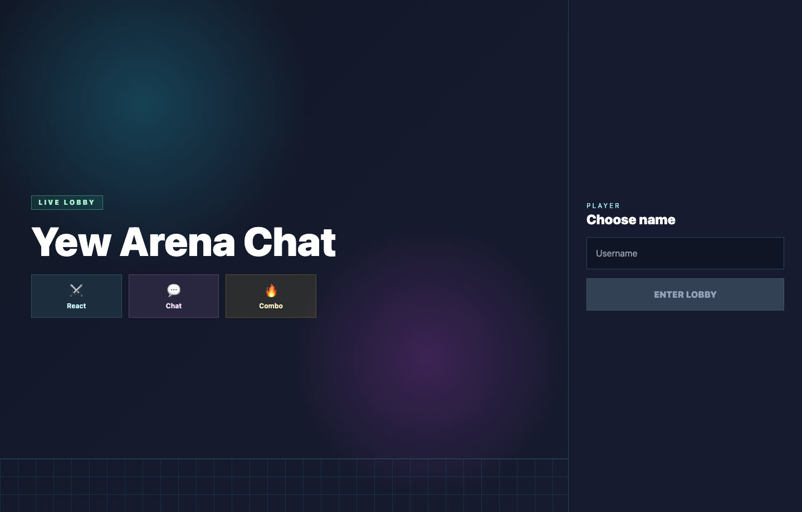
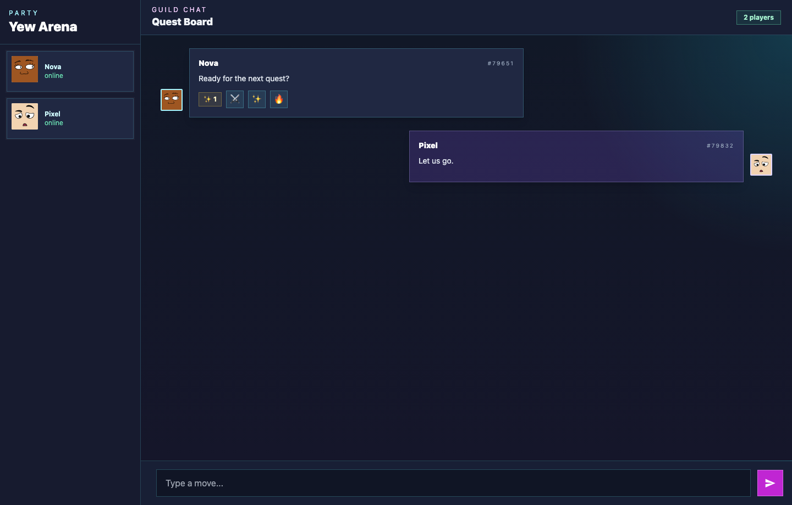

# YewChat 💬

> Source code for [Let’s Build a Websocket Chat Project With Rust and Yew 0.19 🦀](#)

## Install

1. Install the required toolchain dependencies:
   ```npm i```

2. Follow the YewChat post!

## Branches

This repository is divided to branches that correspond to the blog post sections:

* main - The starter code.
* routing - The code at the end of the Routing section.
* components-part1 - The code at the end of the Components-Phase 1 section.
* websockets - The code at the end of the Hello Websockets! section.
* components-part2 - The code at the end of the Components-Phase 2 section.
* websockets-part2 - The code at the end of the WebSockets-Phase 2 section.

# Experiment 3.1


# Experiment 3.2
I changed the app into a game-style chat lobby. The welcome page now feels like a small player entry screen with icon tiles and a stronger arcade layout.

The chat room now supports reactions on other people's messages. Reaction counts are sent through the WebSocket server, and the server prevents users from reacting to their own messages or repeating the same reaction.

